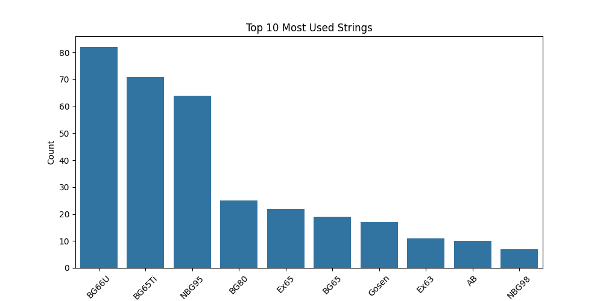
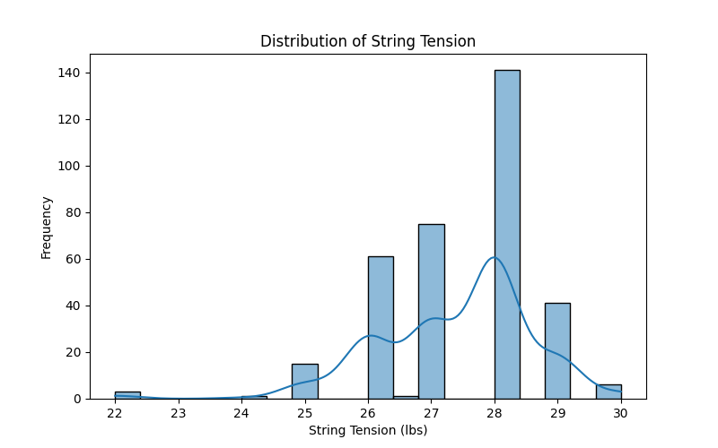

# Badminton Racket Restringing Analysis

## 📌 Project Overview
This project explores trends in badminton racket and string preferences, analyzing string tension distributions and detecting outliers.

## 📊 Quantitative Analysis
- Most popular rackets and strings
- Average string tension per racket
- Outlier detection using IQR method
- Visualizations of tension distribution

### 🔑 Key Takeaways
- AX88D Pro (including the 3rd Gen) is the most popular because it is marketed as one of the best doubles head-heavy rackets. 
- 


## 📁 Project Structure
- **data/**: Contains raw datasets used for the analysis.
- **notebooks/**: Jupyter Notebooks where the exploratory data analysis (EDA) and other analyses are performed.
- **scripts/**: Python scripts for running data analysis, cleaning, and other tasks.
- **images/**: Folder to store visualizations created during analysis.
- **README.md**: Documentation file to describe the project, setup, and usage.
- **requirements.txt**: Lists the Python packages required to run the project


## 📈 Results
### **Most Popular Rackets**


### **Most Popular Strings**


### **String Tension Distribution**


### **Boxplot**


### **Output**
Unique Players: 36
Unique Rackets: 30
Unique Strings: 13

Top Rackets:
 Racket
AX88D Pro     45
AX88D         36
AX100ZZ       26
Arc 11 Pro    20
NF800 Pro     18
AX88D Pro     10
NF800         10
Assorted      10
Z Strike       8
AX77 Pro       8
Name: count, dtype: int64

Top Strings:
 String
BG66U       73
NBG95       56
BG65Ti      37
BG80        19
Gosen       17
BG65         8
NBG98        7
Exbolt65     5
Ex65         4
AB           3
Name: count, dtype: int64

Average Tension by Racket:
 Racket
Ryuga II       29.000000
Z Strike       28.875000
AX100ZZ        28.423077
AX77 Pro       28.375000
AX99 Pro       28.200000
AX88D          28.027778
Vanguard 11    28.000000
Drive9X        28.000000
NR800          28.000000
V11            28.000000
Name: Tension, dtype: float64


## 🔧 Installation
To run this project locally:
```bash
git clone https://github.com/yourusername/badminton-analysis.git
cd badminton-analysis
pip install -r requirements.txt
jupyter notebook
```

