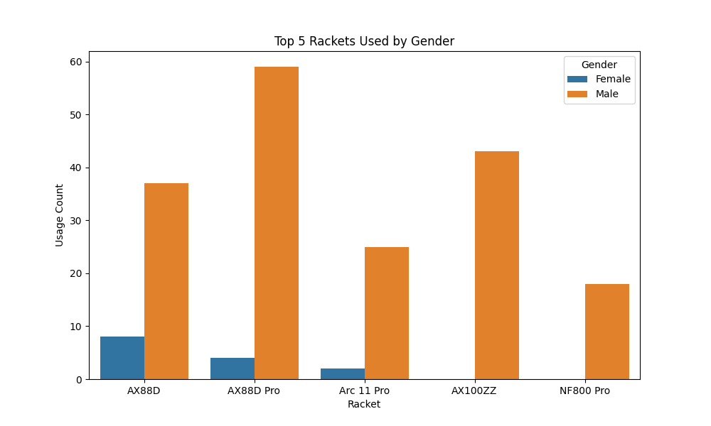
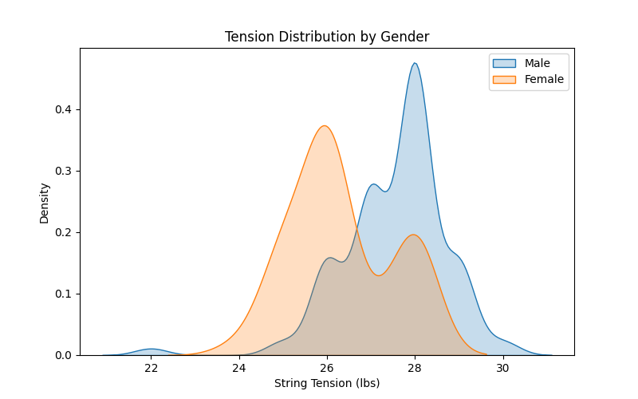
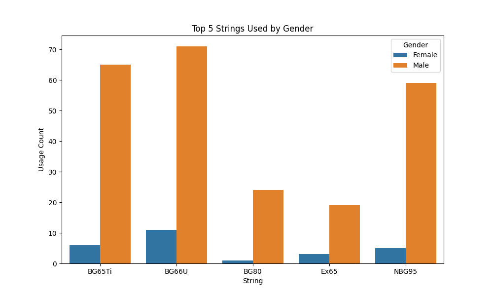

# Badminton Racket Restringing Analysis

## 📌 Project Overview
This project analyzes trends in badminton racket and string preferences by examining string tension distributions, usage patterns, and outliers. The analysis is automatically updated through a GitHub Actions workflow whenever a new .csv file is pushed to the repository.

## 📊 Quantitative Analysis
- Most popular rackets and strings
- Average string tension per racket
- Outlier detection using IQR method
- Visualizations of tension distribution

### 🔑 Key Takeaways
- AX88D Pro (including the 3rd Gen) is the most popular because it is marketed as one of the best doubles head-heavy rackets. 
- Most players prefer BG66UM because it is a high repulsion string. High repulsion means power in exchange for durability. The string is very thin as a result and pop quicker than most strings, especially strung at max recommended tension.
- Based on the data, most players that I have strung for prefer the 28-29 tension. 

#### 📈 Boxplot
- Line inside box means median string tension
- IQR Box
  - Box itself represents the middle 50% of the data (between Q1 and Q3)
  - shorter box means most tensions are more clustered
- Whiskers (lines extending from the box)
  - Whiskers indicate the range of non-outliers
  - They usually extend to 1.5 times the IQR
- Outliers 
  - the Dots outside the whiskers are considered outliers (ex. 22, 23, 24, 25, 30 lbs)
  - Represents uncommon stringing preferences (extreme high or low tensions)
  - These outliers are more unique customer preferences


## 📁 Project Structure
- **data/**: Contains raw datasets used for the analysis.
- **notebooks/**: Jupyter Notebooks where the exploratory data analysis (EDA) and other analyses are performed.
- **scripts/**: Python scripts for running data analysis, cleaning, and other tasks.
- **images/**: Folder to store visualizations created during analysis.
- **README.md**: Documentation file to describe the project, setup, and usage.
- **requirements.txt**: Lists the Python packages required to run the project


## 📈 Results
### **Most Popular Rackets**


### **Most Popular Strings**


### **String Tension Distribution**


### **Boxplot**


### **Gender Comparison**





To see the data in a table, click this link here: [summary.md](summary.md)

## 🔧 Installation
To run this project locally:
```bash
git clone https://github.com/yourusername/badminton-analysis.git
cd badminton-analysis
pip install -r requirements.txt
jupyter notebook
```

